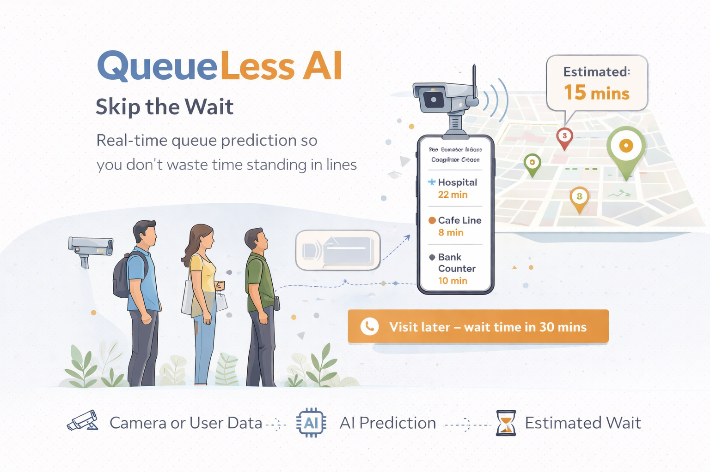
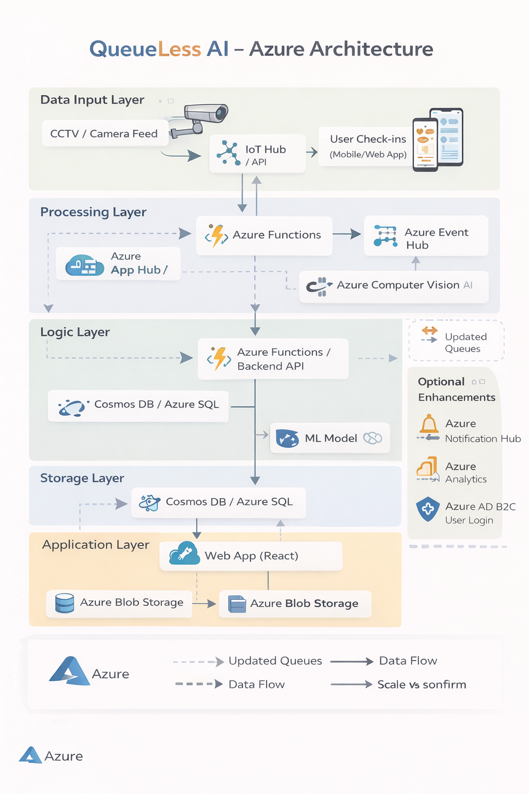

# QueueLess AI

## Overview

QueueLess AI is a real-time queue prediction system designed to reduce
waiting time in public and private spaces such as hospitals, banks,
cafeterias, and service centers. The system uses AI and cloud-based
services to estimate queue length and provide users with accurate
wait-time predictions.

The goal is to help users make better decisions about when to visit a
location, improving efficiency and overall user experience.

## Problem Statement

Waiting in queues is a common issue that leads to wasted time and poor
user experience. Existing solutions do not provide real-time or accurate
predictions of waiting time, leaving users with uncertainty.

QueueLess AI addresses this by providing intelligent, data-driven
insights into queue conditions.

## Solution

QueueLess AI combines real-time data collection with AI-powered analysis
to estimate queue wait times. It processes input from camera feeds or
user check-ins and applies computer vision and predictive logic to
generate accurate estimates.

Users can view queue status through a web interface, allowing them to
plan visits more effectively.

## Key Features

-   Real-time queue detection and monitoring\
-   AI-based wait time prediction\
-   Web dashboard for live updates\
-   Scalable cloud-based architecture\
-   Support for multiple locations

## Architecture

The system is built using Microsoft Azure services:

-   Data Input: CCTV feeds and user check-ins\
-   Processing: Azure Functions and Event Hub\
-   AI Services: Azure Computer Vision and Azure Machine Learning\
-   Storage: Azure Cosmos DB and Blob Storage\
-   Application Layer: Web application hosted on Azure App Service

## Tech Stack

-   Frontend: React\
-   Backend: Node.js / Python\
-   Cloud Platform: Microsoft Azure\
-   AI Services: Azure Computer Vision, Azure Machine Learning\
-   Database: Azure Cosmos DB / Azure SQL

## Workflow

1.  Data is collected from cameras or user inputs\
2.  Azure Functions process incoming data\
3.  Computer Vision detects crowd density\
4.  Machine Learning model predicts wait time\
5.  Results are stored in the database\
6.  Web application displays real-time updates to users

## Future Enhancements

-   Mobile application for wider accessibility\
-   Notification system for queue alerts\
-   Integration with smart city infrastructure\
-   Advanced analytics dashboard using Power BI

## Getting Started

### Prerequisites

-   Azure account\
-   Node.js or Python environment\
-   Basic understanding of cloud services

### Setup

1.  Clone the repository\
2.  Configure Azure services\
3.  Deploy backend APIs\
4.  Run frontend application\
5.  Connect services and test

## Use Cases

-   Hospitals and clinics\
-   Banks and government offices\
-   Restaurants and cafeterias\
-   Retail stores\
-   College campuses

## Contributing

Contributions are welcome. Please fork the repository and submit a pull
request.

## License

This project is intended for educational and hackathon purposes.
